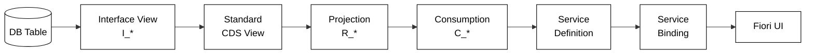
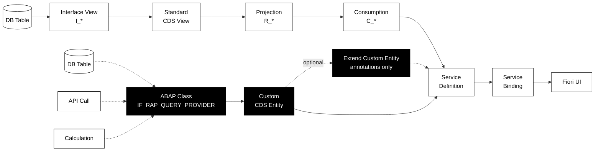

# The CDS Layer

## Two paths into the same Fiori pipeline

= 1 ? 'is-on' : 'is-off'" style="grid-area: 1/1">

A **Custom CDS Entity** skips the table *and* the projection stack — its data
comes from an ABAP class and it is exposed **directly** by the service definition.

ℹ️ **No `R_*` / `C_*` on top:** a custom entity has no persisted source, so it
**cannot** be wrapped in a classic `projection` / `consumption` view
(`select from <CustomEntity>` is not allowed). Need an annotation layer?
Put a **second custom entity** in front — not a standard projection view.

