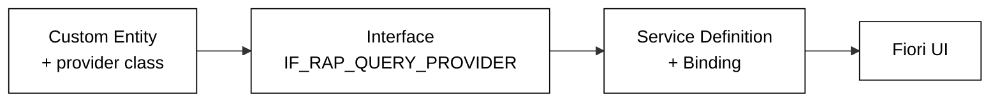

# How Custom CDS Views are built

## Three moving parts

1. A **custom view entity** with `@ObjectModel.query.implementedBy`
2. Freestyle defined fields without database dependence
3. An **ABAP class** implementing `IF_RAP_QUERY_PROVIDER`
4. A **service** exposing it
