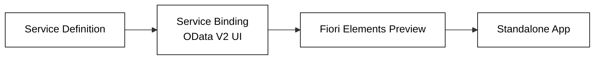

# Service & UI

## Wire it up

```abap
@EndUserText.label: 'Demo Product Service'
define service ZUI_DemoProduct {
  expose ZC_DemoProduct as Product;
}
```

Create a **Service Binding** of type *OData V2 — UI* and hit **Preview**.



You now have a working Fiori app backed by hand-written ABAP.
