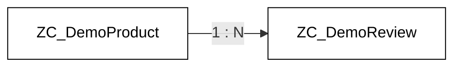

# Extending the example

## Annotations, associations, behavior

We add:

- UI annotations (`@UI.lineItem`, `@UI.selectionField`, ...)
- An **association** to a second custom entity
- Behavior — **create / update / delete**

