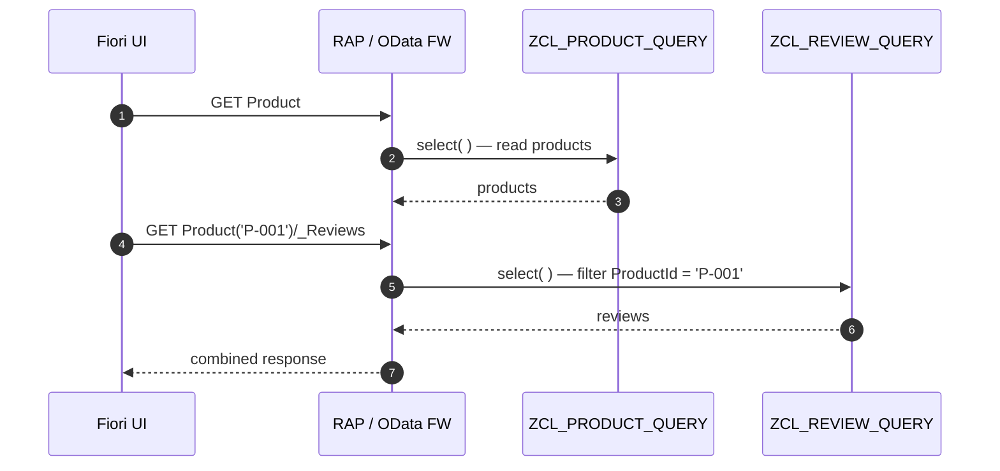

# How associations resolve at runtime

## Each navigation = its own provider call

The framework does **not** join for you. Expanding or drilling into an
association triggers a **separate** `if_rap_query_provider~select` call —
on the **target** entity's provider.

⚠️ `$expand=_Reviews` is just **two reads** under the hood — the parent key
arrives as a **filter** in the child's `select( )`.

