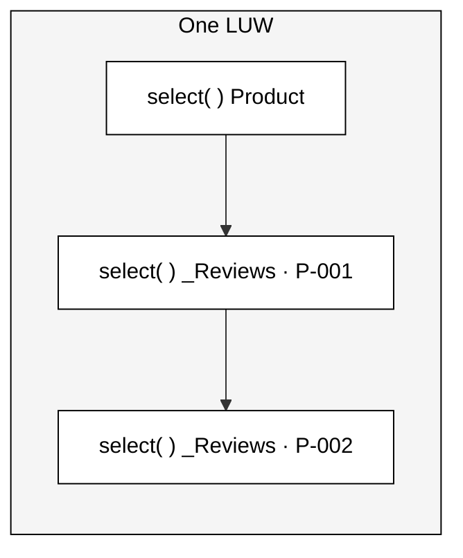

# Many calls, one LUW

## Separate `select`s — same transactional context

Each navigation is an **independent read**, but they all run inside the
**same LUW** (Logical Unit of Work) for that request.

### What that means

- 🔁 N navigations → **N provider calls**
- 🧵 All share **one** LUW / DB transaction
- 👁️ Same **consistent** data snapshot
- 🚫 No implicit `COMMIT` between reads
- 🧩 Writes land in the **same** `save` sequence

Don't open your own connection per call — reuse the request's context so reads stay consistent.

