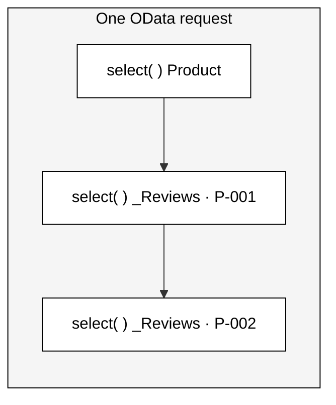

# Many calls, one request

## Separate `select`s — one OData request

A single request (e.g. a list **plus** its `$expand` navigations) triggers
**several independent `select` calls** — one per entity set / navigation.

### What that means

- 🔁 N navigations → **N provider calls**
- 🧩 Each call is **self-contained** — its own request object
- 🔍 Each gets its **own** filter, paging & sorting
- 🛠️ Build each result **independently**

Each <code>select</code> stands on its own — if you need consistency across calls (especially for remote sources), handle it yourself.

